# Demo de rediseño web · Nido Terra Encantada (La Molina)

> ⚠️ **Demo conceptual no oficial.** Propuesta comercial de **INKRAAD** para el Nido Terra Encantada. No es el sitio oficial del nido ni está afiliada a él. Algunos datos están **por confirmar** (ver más abajo).

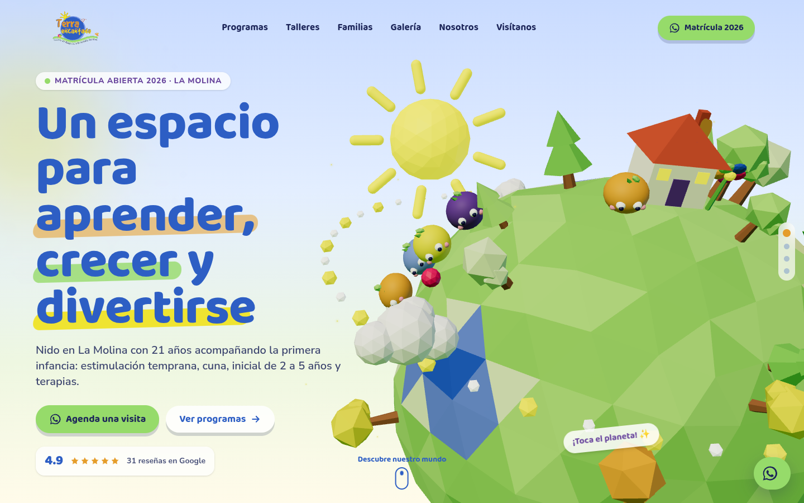

## La marca
- **Qué es:** Nido / centro de educación inicial privado en **La Molina, Lima** (Av. Javier Prado Este 5977). Se presenta como *Centro de Apoyo en el Desarrollo del Niño* / *Centro de desarrollo integral del niño en la edad temprana*.
- **Servicios reales** (afiche Matrícula 2026 y su web): estimulación temprana, pre-escolar 2 años, inicial 3, 4 y 5 años, guardería, inglés intensivo, talleres (karate, psicomotricidad, yoga), departamento psicológico permanente, terapias psicopedagógicas, escuela para padres y alquiler de local para fiestas infantiles.
- **Presencia actual:** una página gratuita de WordPress.com (subdominio numérico, banner “Diseña un sitio como este con WordPress.com”) con errores visibles: dice “Javier Prado **Oeste**” (es Este), un celular de 8 dígitos y enlaces de WhatsApp rotos. Fanpage de Facebook activa (~5 000 seguidores, “21 años” de trayectoria). Instagram no encontrado.

## Qué se construyó
**Concepto: “Terra, un pequeño planeta encantado”.** El logo del nido ya es un mundo: una tierra azul con sol, casita, flor, mariposa y una colina de césped. La web convierte ese dibujo en un **planeta 3D low-poly** con la paleta exacta de la marca, donde la casita del logo es el nido. Al hacer scroll el planeta gira y muestra las tres palabras de su propio slogan —**Aprender, Crecer, Divertirse**— como estaciones de un pequeño viaje, con personajes redondos (“territos”) que rebotan y saltan al tocarlos.

### Secciones
1. **Loader de marca:** el logo aparece en una burbuja mientras el césped “crece” como barra de progreso.
2. **Hero 3D** con el slogan real, matrícula 2026, CTA a WhatsApp y calificación de Google.
3. **Scroll storytelling** (3 estaciones del planeta): Aprender · Crecer · Divertirse.
4. **Propuesta de valor:** 21 años, metodología lúdica/vivencial/experimental, áreas verdes, departamento psicológico + marquesina de verbos.
5. **Programas por edad** (tarjetas con inclinación 3D al pasar el mouse).
6. **Talleres** (karate, psicomotricidad, yoga) con fotos reales en marcos circulares como en sus afiches.
7. **Familias y terapias** (“Nuestro trabajo empieza contigo”).
8. **Galería** de burbujas con parallax y lightbox accesible (teclado, Esc, flechas).
9. **Reseñas de Google:** rating + 3 citas reales (Google vía Exa Places, nov 2018).
10. **Nuestra historia:** “Respetan, retan y acompañan” + alquiler de local para fiestas.
11. **CTA Matrícula 2026** con botón magnético a WhatsApp.
12. **Ubicación:** datos de contacto + mapa ilustrado; el mapa interactivo de Google solo se carga al pulsar (más rápido y sin cookies de terceros al entrar).
13. **Footer** con redes y aviso de demo. Botón flotante de WhatsApp en toda la página.

### Efectos implementados
- Mundo 3D procedural en **React Three Fiber** (planeta icosaédrico con relieve, lagos, árboles, casita, flor y mariposas del logo, sol con rayos que giran, nubes, órbita punteada como el arco de sus afiches 2026, brillitos).
- **GSAP ScrollTrigger** controla el giro/posición del planeta por estaciones; **Lenis** para smooth scroll sincronizado.
- Parallax del planeta con el mouse; clic/tap en el planeta = los personajes saltan.
- Títulos que entran letra por letra con rebote; apariciones al scroll; parallax en la galería.
- **Cursor de marca** (solecito con estela de colores; dice “¡Tócame!” sobre el planeta), botones **magnéticos**, tarjetas con tilt 3D, menú móvil con revelado circular, marquesina.
- **Móvil:** 3D en modo ligero (menos geometría y objetos, sin antialias ni brillitos, DPR ≤ 1.5) y el render se pausa fuera de pantalla.
- **prefers-reduced-motion:** sin Lenis, sin animaciones, planeta estático (render único) y storytelling compacto. Sin WebGL: ilustración del logo como respaldo.
- **Accesibilidad:** contraste AA (combinaciones verificadas en el manual de marca), alt text en todas las fotos, “Saltar al contenido”, foco visible, navegación por teclado, `aria-label` en títulos animados.
- **SEO:** metadatos, Open Graph/Twitter con imagen propia (`public/og-image.jpg`), JSON-LD schema.org `Preschool` + `LocalBusiness` (dirección, geo, horario, programas, Facebook).

### Identidad
- **Logo:** `brand/logo-facebook.jpg` (original) vectorizado a `brand/logo-terra-encantada.svg` respetando los trazos manuscritos originales (vectorización por capas de color con potrace + casita, flor y mariposa redibujadas). Comparación lado a lado: `brand/logo-comparacion-original-vs-svg.png`.
- **Manual de marca:** `brand/manual-de-marca.md` (paleta #2D5EC4 #96DB6A #F0E31D #E59D2A #6A479E #D0E9B1, tipografías Baloo 2 + Nunito, tono, iconografía y usos).

## Tecnologías
Vite 8 · React 19 · TypeScript · Tailwind CSS v4 · Three.js (r182) · @react-three/fiber · @react-three/drei · GSAP + ScrollTrigger · Lenis · Motion · Fontsource (Baloo 2, Nunito) · Playwright (capturas).

## Cómo correrlo
```bash
cd site
npm install
npm run dev        # desarrollo
npm run build      # build estático en site/dist
npx vite preview --port 4173 &   # servir el build
node scripts/screenshots.mjs      # capturas desktop/móvil + reporte de errores de consola
node scripts/og-image.mjs         # regenerar la imagen Open Graph
```
(Node 20.19+; los scripts de Playwright usan `/usr/bin/google-chrome`, configurable con `CHROME=`.)

## Datos de ejemplo y datos por confirmar
| Dato | Estado |
|---|---|
| **Calificación 4.9★ con 31 reseñas en Google** | ⚠️ **Por confirmar.** Obtenido de Exa Places (espejo de Google Maps), no verificado en vivo. Marcado en `src/data/brand.ts`. No se incluyó en el schema.org. |
| **WhatsApp 993 726 482 / teléfono 965 140 046** | ⚠️ **Por confirmar** cuál es el número vigente. La investigación encontró 4 números (993 726 482 afiche 2026 y FB; 965 140 046 Google/web; 987 817 612 MINEDU; 949 728 605 web). Marcado en código. |
| “21 años” de trayectoria | Según su fanpage; año de fundación exacto por confirmar. |
| Reseñas citadas | **Reales** (Google vía Exa Places, nov 2018); sin nombre de autor porque la fuente no lo muestra. No hay testimonios inventados. |
| Descripciones de programas, talleres, terapias y pasos de matrícula | **Contenido de ejemplo** redactado por INKRAAD a partir de los servicios reales. |
| Dominio `terraencantada.pe` en canonical/schema | **Ejemplo** (el nido no tiene dominio propio). |
| Horario Lun–Vie 8:00–17:00, correo, dirección, código modular MINEDU 1358944 | Según brand.md (ficha Google / MINEDU). |
| Precios / vacantes | No se muestran (la pensión S/ 700 de MINEDU no está confirmada). |

## Créditos de imágenes
- Todas las fotos son **reales del nido**, recortadas de sus afiches publicados en Facebook/web (Matrícula 2026, “Inicial 3, 4 y 5 años”, “Talleres todo el año”). Originales en `brand/fotos/`. Para producción conviene pedir los archivos originales en mayor resolución.
- Logo: propiedad del Nido Terra Encantada (vectorización de INKRAAD para esta demo).
- Ilustraciones 3D, íconos y mapa ilustrado: creación propia (código).

## Capturas
| Desktop | Móvil |
|---|---|
|  | 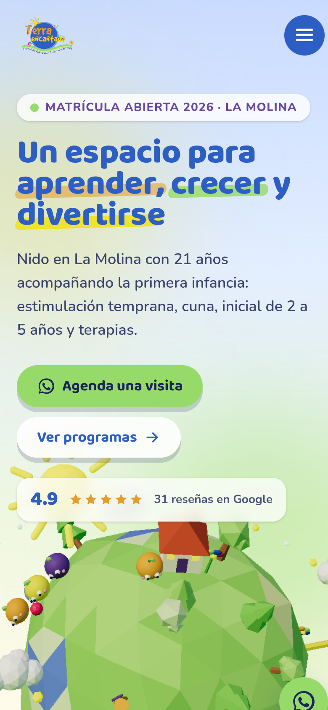 |
| 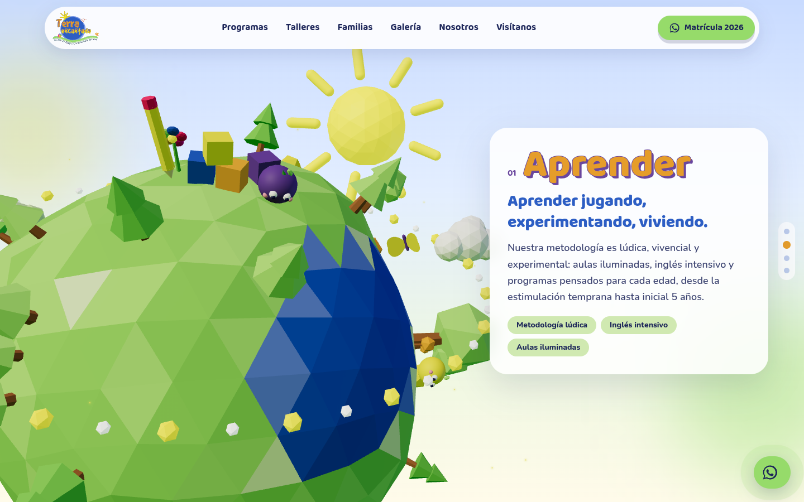 | 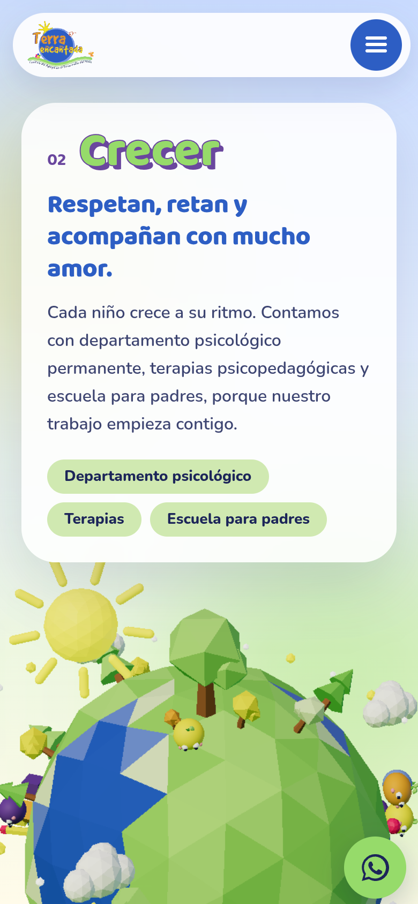 |
| 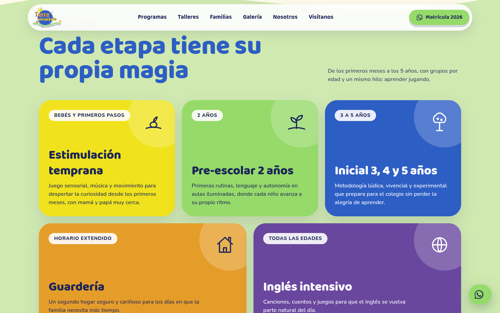 | 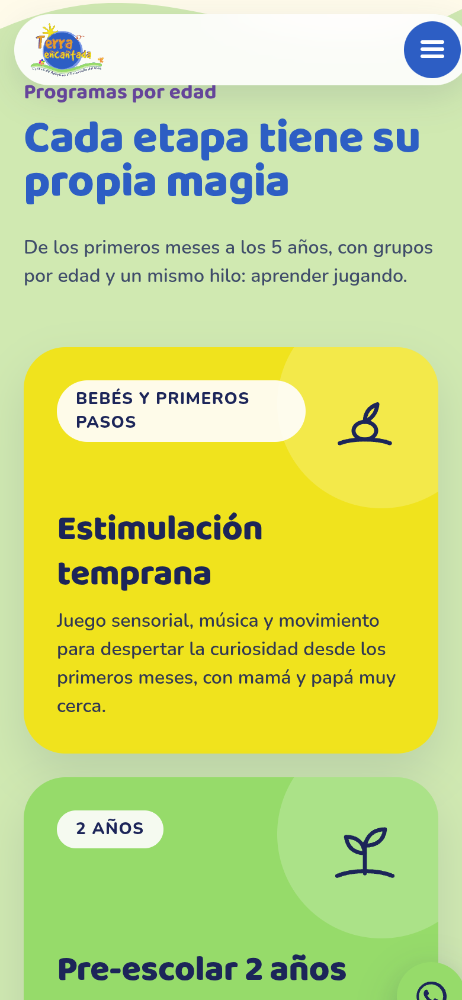 |
| 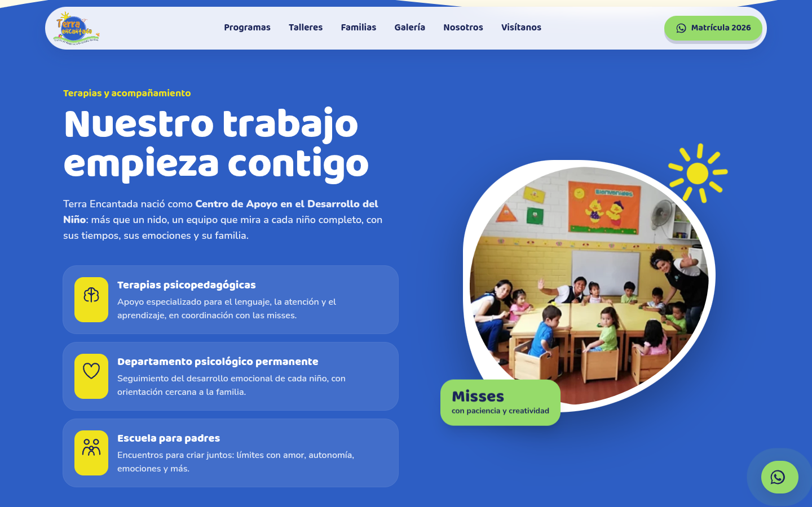 | 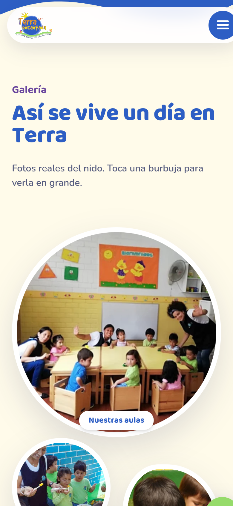 |
| 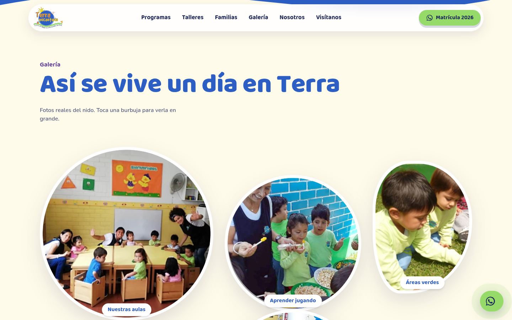 | 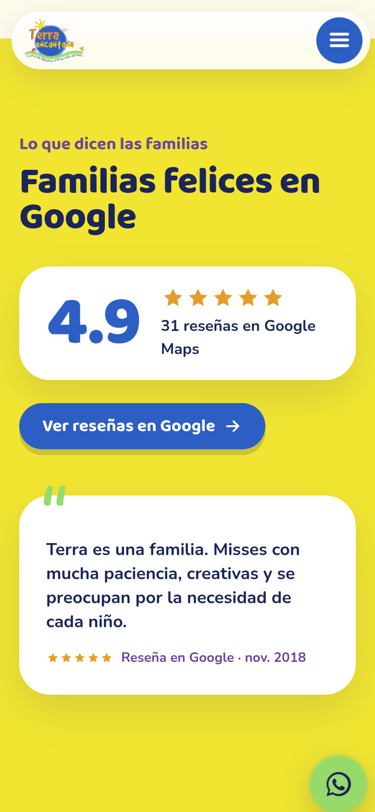 |
| 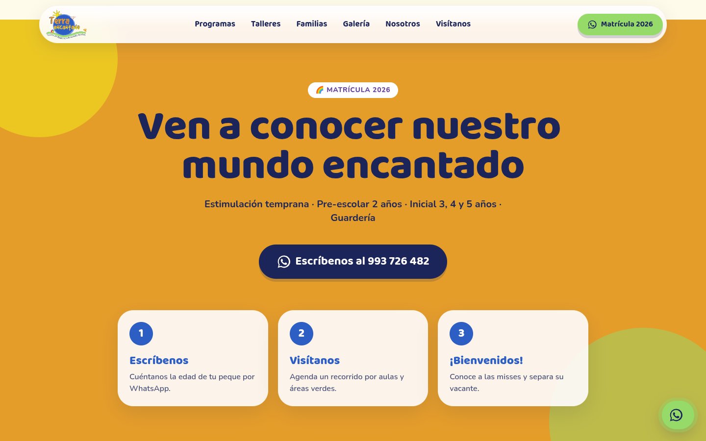 | 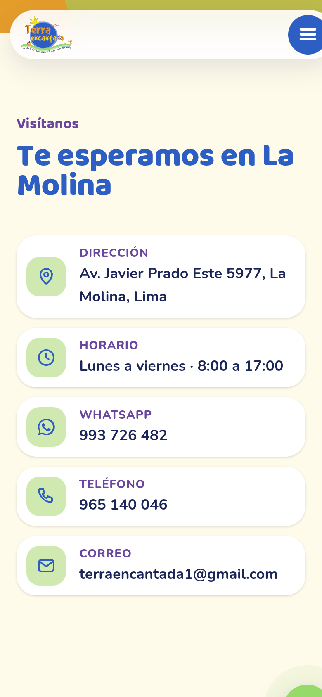 |

Todas las capturas: `site/screenshots/`.

---
Demo elaborada por **INKRAAD** · octubre 2026.
